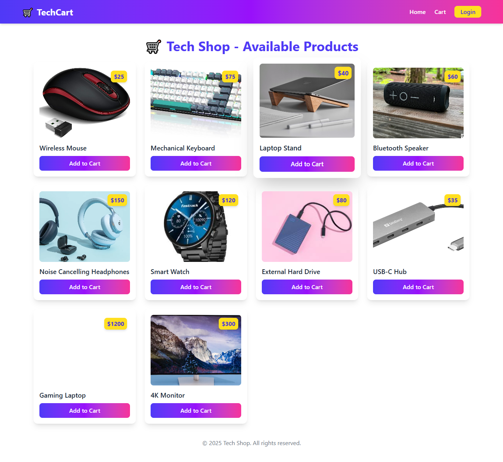
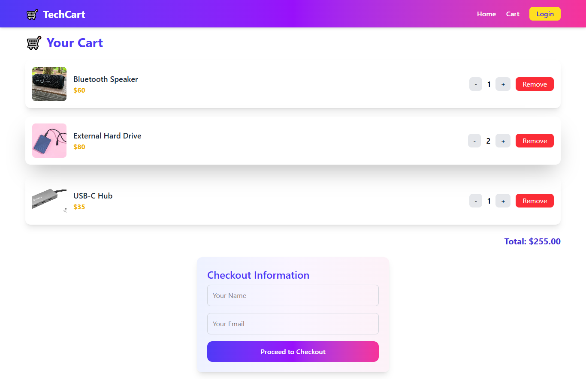

```markdown
# 🛒 MockCartSystem - Full Stack Tech-Shop

A modern, colorful **shopping cart system** built with **React + Tailwind** (frontend) and **Node.js + Express + MongoDB** (backend).  
This project demonstrates a **full-stack e-commerce workflow**: product listing, cart management, checkout form, and receipt modal.

---

## 🌟 Features

- Browse products from the database
- Add items to the cart
- Update item quantity or remove items
- View total dynamically
- Checkout form with name & email
- Receipt modal after order submission
- Responsive design for desktop & mobile
- Colorful, tech-shop style UI

---

## 🛠️ Tech Stack

- **Frontend:** React, Tailwind CSS, React Hot Toast
- **Backend:** Node.js, Express.js, Mongoose
- **Database:** MongoDB
- **HTTP Requests:** REST APIs

---
```

## 🏗️ Project Structure

```
MockCartSystem/
├── backend/
│ ├── index.js
│ ├── models/
│ ├── routes/
│ ├── config/
│ └── package.json
├── frontend/
│ ├── src/
│ ├── components/
│ ├── pages/
│ ├── api/
│ └── package.json
├── README.md

```

---

## 🚀 Setup Instructions

### 1️⃣ Clone Repository

```bash
git clone https://github.com/sowmitraguho/ecom-cart-system
cd ecom-cart-system
```

### 2️⃣ Setup Backend

```bash
cd backend
npm install
npm start
```

- Backend runs on `http://localhost:5000`
- Make sure **MongoDB** is running locally or configure `.env` with MongoDB URI

### 3️⃣ Setup Frontend

```bash
cd ../frontend
npm install
npm run dev
```

- Frontend runs on `http://localhost:5173` (or port assigned by Vite)

---

## 📸 Screenshots

### Home Page



### Cart Page



---

## 🎥 Demo Video

Watch the **1-2 minute demo** here:
[Demo Video - ](https://youtu.be/mvZp1HbG5Qk)

---

## ⚡ Usage

1. Browse products and add them to the cart
2. Update quantity or remove items as needed
3. Enter name and email in the checkout form
4. View receipt modal and confirm order
5. Total updates dynamically

---

## ✅ Notes

- Fully responsive, works on mobile and desktop
- Styled with modern gradients, hover effects, and shadow cards
- REST API integration between frontend and backend
- Easy to extend for additional features like authentication or payment integration

---

## 📝 License

MIT License

```

---

### ✅ What’s included
1. **Setup instructions** for backend and frontend
2. **Screenshots section** (just add your actual images in `screenshots/` folder)
3. **Demo video link placeholder**
4. Clean **tech-shop style explanation**

---

I can also create a **ready-to-use screenshots folder structure** with **mock screenshots names** and a **small tip on recording the Loom demo**, so you just drop images/video in and submit.

Do you want me to do that next?
```
